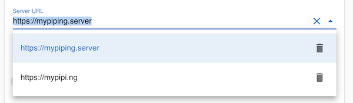

# Piping UI
[](https://app.netlify.com/sites/piping-ui/deploys)  
<a href="https://piping-ui.org"></a>

Web UI for [Piping Server](https://github.com/nwtgck/piping-server)  


## Application
<https://piping-ui.org>

## Features

- Download while uploading
- [Progressive Web Apps](https://developers.google.com/web/progressive-web-apps) (PWA)
- Dark theme
- English/Japanese
- Multi-file sending with zip
- Auto completes for server URLs and secret paths
- Image/video preview
- Passwordless E2E encryption by [Elliptic-curve Diffie–Hellman] and [OpenPGP.js]
- Password protection powered by [OpenPGP.js]

## Self-hosting

You can build Piping UI by yourself like the following.

```console
$ git clone https://github.com/nwtgck/piping-ui-web.git
$ cd piping-ui-web
$ npm ci
$ npm run build
```

Then, you can publish `./dist`.  
In addition, you can also use hosting services such as GitHub pages and Netlify.

### Change default Piping Server URLs at build-time

Set env `$PIPING_SERVER_URLS` to change default Piping Server URLs.

```console
$ PIPING_SERVER_URLS='["https://mypiping.server", "https://mypipi.ng"]' npm run build
```



## Sitemap for telling about localized versions

Set env `$SITE_URL` to generate `sitemap.xml` for telling about localized versions. `robots.txt` has also `Sitemap: ...` section.  
(see: <https://support.google.com/webmasters/answer/189077>)  
(see: <https://developers.google.com/search/reference/robots_txt#google-supported-non-group-member-lines>)

```console
$ SITE_URL="https://mypiping.ui" npm run build
```

## Logo
<div>Icons made by <a href="https://www.flaticon.com/authors/freepik" title="Freepik">Freepik</a> from <a href="https://www.flaticon.com/" title="Flaticon">www.flaticon.com</a></div>


[Elliptic-curve Diffie–Hellman]: https://en.wikipedia.org/wiki/Elliptic-curve_Diffie%E2%80%93Hellman
[OpenPGP.js]: https://github.com/openpgpjs/openpgpjs
